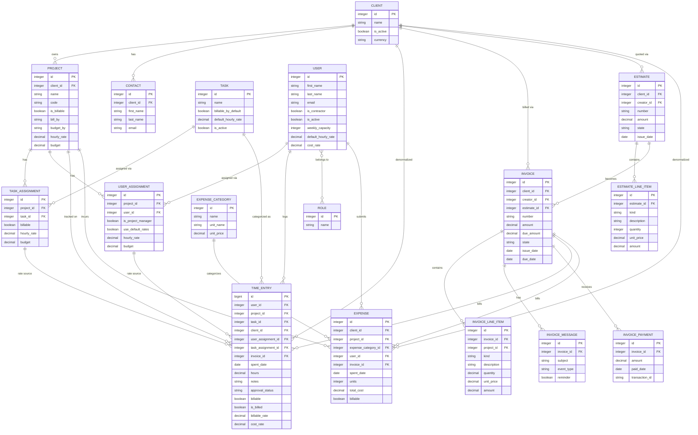

# Harvest Data Model

> Reverse-engineered from the **Harvest API v2** docs (the request/response field
> lists *are* the schema). All field names below are taken verbatim from
> `help.getharvest.com/api-v2/...`. Where a relationship is not stated explicitly
> in the docs it is marked **(assumed)**.
>
> Purpose: drive the database schema for an internal time-tracking rebuild
> (hackathon). The time-tracking core is the priority; invoicing/estimates/expenses
> are a secondary cluster (phase 2).

---

## 1. Entity Catalogue

Type conventions used below:
- `bigint` / `integer` — numeric primary keys / foreign keys
- `decimal` — money or hours (store as `numeric`/`decimal`, never float)
- `date` — calendar date (no time)
- `time` — wall-clock time of day
- `datetime` — ISO 8601 timestamp (store as `timestamptz`)
- `string`, `boolean`, `array`

Nested objects in the API (e.g. `client`, `project`, `task`, `user`) represent a
**foreign-key reference** in a relational schema. Below they are noted as
"FK → Entity" and the embedded `id`/`name` fields collapse to a single FK column
(`client_id`, `project_id`, etc.).

---

### Company
The tenant / account settings singleton. One row per Harvest account. Holds
display and feature-flag preferences rather than transactional data.

| Field | Type | Notes |
|---|---|---|
| `base_uri` | string | Harvest URL for the company |
| `full_domain` | string | Harvest domain |
| `name` | string | Company name |
| `is_active` | boolean | Active or archived |
| `week_start_day` | string | `Saturday` / `Sunday` / `Monday` |
| `wants_timestamp_timers` | boolean | Duration vs start/end time tracking |
| `time_format` | string | `decimal` or `hours_minutes` |
| `date_format` | string | e.g. `%m/%d/%Y` |
| `plan_type` | string | `trial`, `free`, `simple-v4`, … |
| `clock` | string | `12h` or `24h` |
| `currency_code_display` | string | `iso_code_none` / `iso_code_before` / `iso_code_after` |
| `currency_symbol_display` | string | `symbol_none` / `symbol_before` / `symbol_after` |
| `decimal_symbol` | string | Decimal formatting symbol |
| `thousands_separator` | string | Thousands formatting separator |
| `color_scheme` | string | Web-client color scheme |
| `weekly_capacity` | integer | Default weekly capacity in **seconds** |
| `expense_feature` | boolean | Expense module enabled |
| `invoice_feature` | boolean | Invoice module enabled |
| `estimate_feature` | boolean | Estimate module enabled |
| `approval_feature` | boolean | Approval module enabled |
| `team_feature` | boolean | Team module enabled |

---

### Client
A customer the company does work for. Owns projects, invoices, estimates, and
contacts.

| Field | Type | Notes |
|---|---|---|
| `id` | integer | PK |
| `name` | string | Client name |
| `is_active` | boolean | Active or archived |
| `address` | string | Physical address |
| `statement_key` | string | Key for client-facing statement/invoice dashboard URL |
| `currency` | string | ISO currency code for this client |
| `created_at` | datetime | |
| `updated_at` | datetime | |

---

### Contact
A person at a client (billing/invoice recipient). Belongs to a Client.

| Field | Type | Notes |
|---|---|---|
| `id` | integer | PK |
| `client` | object → **FK → Client** (`id`, `name`) | Parent client |
| `title` | string | |
| `first_name` | string | |
| `last_name` | string | |
| `email` | string | |
| `phone_office` | string | |
| `phone_mobile` | string | |
| `fax` | string | |
| `invoice_recipient_status` | string | `none` / `recipient` / `cc` / `bcc` (default `none`) |
| `created_at` | datetime | |
| `updated_at` | datetime | |

---

### Project
A unit of work for a client. Central hub of the time-tracking core: time entries,
expenses, task assignments and user assignments all hang off it. Carries the
billing and budgeting configuration.

| Field | Type | Notes |
|---|---|---|
| `id` | integer | PK |
| `client` | object → **FK → Client** (`id`, `name`, `currency`) | Owning client |
| `name` | string | |
| `code` | string | Project code |
| `is_active` | boolean | Active or archived |
| `is_billable` | boolean | |
| `is_fixed_fee` | boolean | |
| `bill_by` | string | `Project` / `Tasks` / `People` / `none` |
| `hourly_rate` | decimal | Used when `bill_by` = `Project` |
| `budget_by` | string | `project` / `project_cost` / `task` / `task_fees` / `person` / `none` |
| `budget_is_monthly` | boolean | Budget resets monthly |
| `budget` | decimal | Time budget in hours |
| `cost_budget` | decimal | Monetary budget |
| `cost_budget_include_expenses` | boolean | |
| `notify_when_over_budget` | boolean | |
| `over_budget_notification_percentage` | decimal | Alert threshold % |
| `over_budget_notification_date` | date | Last notification (nullable) |
| `show_budget_to_all` | boolean | Budget visible to all employees |
| `fee` | decimal | Fixed-fee invoice amount |
| `notes` | string | |
| `starts_on` | date | |
| `ends_on` | date | |
| `created_at` | datetime | |
| `updated_at` | datetime | |

---

### Task
A *type* of work (e.g. "Design", "Development", "Meeting"). Defined once at the
account level, then attached to projects via Task Assignments.

| Field | Type | Notes |
|---|---|---|
| `id` | integer | PK |
| `name` | string | |
| `billable_by_default` | boolean | Default billable state when added to a project |
| `default_hourly_rate` | decimal | Rate used when task added to a project |
| `is_default` | boolean | Auto-added to future projects |
| `is_active` | boolean | Active or archived |
| `created_at` | datetime | |
| `updated_at` | datetime | |

---

### TaskAssignment  *(join entity: Project ↔ Task)*
Associates a Task with a Project, with project-specific billable flag, rate and
budget overrides. This is the many-to-many bridge between Project and Task.

| Field | Type | Notes |
|---|---|---|
| `id` | integer | PK |
| `project` | object → **FK → Project** (`id`, `name`, `code`) | |
| `task` | object → **FK → Task** (`id`, `name`) | |
| `is_active` | boolean | |
| `billable` | boolean | |
| `hourly_rate` | decimal | Used when project `bill_by` = `Tasks` |
| `budget` | decimal | Used when project `budget_by` = `task` / `task_fees` |
| `created_at` | datetime | |
| `updated_at` | datetime | |

---

### UserAssignment  *(join entity: Project ↔ User)*
Associates a User with a Project, including PM permission and per-project
rate/budget overrides. Many-to-many bridge between Project and User. Determines
who is allowed to log time against a project.

| Field | Type | Notes |
|---|---|---|
| `id` | integer | PK |
| `project` | object → **FK → Project** (`id`, `name`, `code`) | |
| `user` | object → **FK → User** (`id`, `name`) | |
| `is_active` | boolean | |
| `is_project_manager` | boolean | PM permissions on this project |
| `use_default_rates` | boolean | Use user's default billable rate vs. the override below |
| `hourly_rate` | decimal | Override used when project `bill_by` = `People` and defaults disabled |
| `budget` | decimal | Used when project `budget_by` = `person` |
| `created_at` | datetime | |
| `updated_at` | datetime | |

---

### TimeEntry
The atomic record of work — the heart of the product. References the user,
project, task and (denormalized) client; carries hours, dates, timer state,
approval state and billing snapshot.

| Field | Type | Notes |
|---|---|---|
| `id` | bigint | PK |
| `spent_date` | date | Day the time was tracked |
| `hours` | decimal | Total hours (decimal) |
| `hours_without_timer` | decimal | Hours before timer last started |
| `rounded_hours` | decimal | Hours used in reports/invoices, rounded per prefs |
| `notes` | string | |
| `is_locked` | boolean | |
| `locked_reason` | string | |
| `is_closed` | boolean | **Deprecated** — use `approval_status` |
| `approval_status` | string | `unsubmitted` / `submitted` / `approved` |
| `is_billed` | boolean | Marked as invoiced |
| `timer_started_at` | datetime | When timer started (null if stopped) |
| `started_time` | time | Start time (start/end tracking) |
| `ended_time` | time | End time (start/end tracking) |
| `is_running` | boolean | Timer currently active |
| `billable` | boolean | |
| `budgeted` | boolean | Counts toward project budget |
| `billable_rate` | decimal | Snapshot of billable rate |
| `cost_rate` | decimal | Snapshot of cost rate |
| `created_at` | datetime | |
| `updated_at` | datetime | |
| `user` | object → **FK → User** (`id`, `name`) | Who logged it |
| `client` | object → **FK → Client** (`id`, `name`) | Denormalized via project |
| `project` | object → **FK → Project** (`id`, `name`) | |
| `task` | object → **FK → Task** (`id`, `name`) | |
| `user_assignment` | object → **FK → UserAssignment** | Full assignment with rates/permissions |
| `task_assignment` | object → **FK → TaskAssignment** | Full assignment with rates |
| `invoice` | object → **FK → Invoice** (`id`, `number`) | Set once invoiced (nullable) |
| `external_reference` | object | `id`, `group_id`, `account_id`, `permalink`, `service`, `service_icon_url` — links to an external system (e.g. Trello/Basecamp) |

---

### User
A person with a Harvest login (employee or contractor). Logs time, may be a PM,
and carries default billable/cost rates.

| Field | Type | Notes |
|---|---|---|
| `id` | integer | PK |
| `first_name` | string | |
| `last_name` | string | |
| `email` | string | |
| `telephone` | string | |
| `timezone` | string | |
| `has_access_to_all_future_projects` | boolean | Auto-added to new projects |
| `is_contractor` | boolean | Contractor vs employee |
| `is_active` | boolean | Active or archived |
| `weekly_capacity` | integer | Hours/week available, **in seconds**, half-hour increments |
| `default_hourly_rate` | decimal | Default billable rate on projects |
| `cost_rate` | decimal | Internal cost rate (for cost vs billable calc) |
| `roles` | array of strings | Descriptive business role names (free-text **Teammate roles**) |
| `access_roles` | array of strings | Permission/access role(s) in Harvest |
| `avatar_url` | string | |
| `created_at` | datetime | |
| `updated_at` | datetime | |

> **Teammate / BillableRate / CostRate note:** the public API v2 exposes a single
> User object. "Teammate" is Harvest's UI term for a User row. There is **no
> separate `BillableRate` or `CostRate` table in the v2 API** — rates are denormalized
> onto User (`default_hourly_rate`, `cost_rate`), UserAssignment (`hourly_rate`),
> TaskAssignment (`hourly_rate`), and snapshotted onto TimeEntry
> (`billable_rate`, `cost_rate`). Harvest's UI keeps **rate history** internally;
> if the rebuild needs effective-dated rates, model `BillableRate` / `CostRate` as
> child tables of User with `(amount, start_date)` — see Rebuild Notes. **(assumed —
> the v2 API does not return a rate-history collection.)**

---

### Role
A named business role grouping users (e.g. "Designer", "Engineering"). The
`roles` array on User is the denormalized view of these. Account-level.

| Field | Type | Notes |
|---|---|---|
| `id` | integer | PK |
| `name` | string | |
| `user_ids` | array of integers | Users assigned to this role — implies **many-to-many Role ↔ User** |
| `created_at` | datetime | |
| `updated_at` | datetime | |

---

### Expense
A non-time cost logged against a project (mileage, materials, etc.). Mirrors
TimeEntry's approval/lock/billing lifecycle.

| Field | Type | Notes |
|---|---|---|
| `id` | integer | PK |
| `spent_date` | date | |
| `units` | integer | Quantity (× category unit_price) |
| `total_cost` | decimal | Total amount |
| `notes` | string | |
| `billable` | boolean | |
| `is_closed` | boolean | **Deprecated** — use `approval_status` |
| `approval_status` | string | `unsubmitted` / `submitted` / `approved` |
| `is_locked` | boolean | |
| `locked_reason` | string | |
| `is_billed` | boolean | Marked as invoiced |
| `created_at` | datetime | |
| `updated_at` | datetime | |
| `client` | object → **FK → Client** (`id`, `name`, `currency`) | |
| `project` | object → **FK → Project** (`id`, `name`, `code`) | |
| `expense_category` | object → **FK → ExpenseCategory** (`id`, `name`, `unit_price`, `unit_name`) | |
| `user` | object → **FK → User** (`id`, `name`) | |
| `user_assignment` | object → **FK → UserAssignment** | |
| `invoice` | object → **FK → Invoice** (`id`, `number`) | Nullable until invoiced |
| `receipt` | object | `url`, `file_name` — attached receipt file |

---

### ExpenseCategory
A type of expense (e.g. "Mileage", "Meals") with a default unit price/name.
Account-level.

| Field | Type | Notes |
|---|---|---|
| `id` | integer | PK |
| `name` | string | |
| `unit_name` | string | e.g. "mile", "km" (nullable) |
| `unit_price` | decimal | Per-unit price (nullable) |
| `is_active` | boolean | |
| `created_at` | datetime | |
| `updated_at` | datetime | |

---

### Invoice
A bill sent to a client. Aggregates line items derived from time/expenses, plus
tax/discount/payment lifecycle.

| Field | Type | Notes |
|---|---|---|
| `id` | integer | PK |
| `client` | object → **FK → Client** (`id`, `name`) | |
| `creator` | object → **FK → User** (`id`, `name`) | |
| `retainer` | object → **FK → Retainer** (`id`) | Nullable |
| `estimate` | object → **FK → Estimate** (`id`) | Nullable — source estimate |
| `client_key` | string | Public web-invoice URL key |
| `number` | string | Invoice number (auto if unset) |
| `purchase_order` | string | |
| `amount` | decimal | Total incl. tax/discount |
| `due_amount` | decimal | Outstanding balance |
| `tax` | decimal | Primary tax % |
| `tax_amount` | decimal | Calculated primary tax |
| `tax2` | decimal | Secondary tax % |
| `tax2_amount` | decimal | Calculated secondary tax |
| `discount` | decimal | Discount % |
| `discount_amount` | decimal | Calculated discount |
| `subject` | string | |
| `notes` | string | |
| `currency` | string | |
| `state` | string | `draft` / `open` / `paid` / `closed` |
| `period_start` | date | Time-entry period covered |
| `period_end` | date | |
| `issue_date` | date | |
| `due_date` | date | |
| `payment_term` | string | |
| `payment_options` | array | Available payment methods |
| `sent_at` | datetime | |
| `paid_at` | datetime | |
| `paid_date` | date | |
| `closed_at` | datetime | |
| `recurring_invoice_id` | integer | Source recurring invoice (nullable) |
| `created_at` | datetime | |
| `updated_at` | datetime | |
| `line_items` | array of **InvoiceLineItem** | See below |

---

### InvoiceLineItem  *(child of Invoice)*
A single billed line on an invoice.

| Field | Type | Notes |
|---|---|---|
| `id` | integer | PK |
| (parent) | **FK → Invoice** | Owning invoice (implicit via nesting) |
| `kind` | string | Item category |
| `description` | string | |
| `quantity` | decimal | |
| `unit_price` | decimal | |
| `amount` | decimal | Line subtotal |
| `taxed` | boolean | Apply primary tax |
| `taxed2` | boolean | Apply secondary tax |
| `project` | object → **FK → Project** (`id`, `name`, `code`) | Nullable |

---

### InvoiceMessage  *(child of Invoice)*
An email/event record associated with an invoice (sends, reminders, thank-yous,
state-change events).

| Field | Type | Notes |
|---|---|---|
| `id` | integer | PK |
| (parent) | **FK → Invoice** | Owning invoice |
| `sent_by` | string | Creator name |
| `sent_by_email` | string | |
| `sent_from` | string | Sender name |
| `sent_from_email` | string | |
| `recipients` | array | Each: `name`, `email` |
| `subject` | string | |
| `body` | string | |
| `include_link_to_client_invoice` | boolean | Deprecated |
| `attach_pdf` | boolean | |
| `send_me_a_copy` | boolean | |
| `thank_you` | boolean | |
| `event_type` | string | `close` / `draft` / `re-open` / `send` |
| `reminder` | boolean | |
| `send_reminder_on` | date | |
| `created_at` | datetime | |
| `updated_at` | datetime | |

---

### InvoicePayment  *(child of Invoice)*
A recorded payment against an invoice.

| Field | Type | Notes |
|---|---|---|
| `id` | integer | PK |
| (parent) | **FK → Invoice** | Owning invoice |
| `amount` | decimal | |
| `paid_at` | datetime | |
| `paid_date` | date | |
| `recorded_by` | string | |
| `recorded_by_email` | string | |
| `notes` | string | |
| `transaction_id` | string | Card auth / PayPal txn ID |
| `payment_gateway` | object | `id`, `name` (nested) |
| `created_at` | datetime | |
| `updated_at` | datetime | |

---

### Estimate
A quote sent to a client before work. Structurally parallel to Invoice (line
items, tax, discount) but with an accept/decline lifecycle instead of payment.

| Field | Type | Notes |
|---|---|---|
| `id` | integer | PK |
| `client` | object → **FK → Client** (`id`, `name`) | |
| `creator` | object → **FK → User** (`id`, `name`) | |
| `client_key` | string | Public web URL key |
| `number` | string | Estimate number (auto if unset) |
| `purchase_order` | string | |
| `amount` | decimal | Total incl. tax/discount |
| `tax` | decimal | Primary tax % |
| `tax_amount` | decimal | |
| `tax2` | decimal | Secondary tax % |
| `tax2_amount` | decimal | |
| `discount` | decimal | Discount % |
| `discount_amount` | decimal | |
| `subject` | string | |
| `notes` | string | |
| `currency` | string | |
| `state` | string | `draft` / `sent` / `accepted` / `declined` |
| `issue_date` | date | |
| `sent_at` | datetime | |
| `accepted_at` | datetime | |
| `declined_at` | datetime | |
| `created_at` | datetime | |
| `updated_at` | datetime | |
| `line_items` | array of **EstimateLineItem** | See below |

---

### EstimateLineItem  *(child of Estimate)*
A single line on an estimate.

| Field | Type | Notes |
|---|---|---|
| `id` | integer | PK |
| (parent) | **FK → Estimate** | Owning estimate (implicit via nesting) |
| `kind` | string | Item category |
| `description` | string | |
| `quantity` | integer | |
| `unit_price` | decimal | |
| `amount` | decimal | Line subtotal |
| `taxed` | boolean | Apply primary tax |
| `taxed2` | boolean | Apply secondary tax |

---

## 2. Relationships

**Time-tracking core**

- **Client 1 — N Project** — a client owns many projects (`Project.client`).
- **Client 1 — N Contact** — a client has many contacts (`Contact.client`).
- **Project N — M Task** *via* **TaskAssignment** — join table; `TaskAssignment`
  carries per-project `billable`, `hourly_rate`, `budget`.
- **Project N — M User** *via* **UserAssignment** — join table; `UserAssignment`
  carries `is_project_manager`, `use_default_rates`, `hourly_rate`, `budget`.
  This is what gates who can log time on a project.
- **User 1 — N TimeEntry** — a user logs many time entries (`TimeEntry.user`).
- **Project 1 — N TimeEntry** — entries belong to a project (`TimeEntry.project`).
- **Task 1 — N TimeEntry** — entries reference a task (`TimeEntry.task`).
- **Client 1 — N TimeEntry** — denormalized on the entry via the project
  (`TimeEntry.client`).
- **TimeEntry → UserAssignment** and **TimeEntry → TaskAssignment** — each entry
  also points at the specific assignment rows it was logged under (rate source).
- **User N — M Role** *via* `Role.user_ids` (and the denormalized `User.roles`
  string array). Many-to-many between users and named roles.

**Billing cluster**

- **Client 1 — N Invoice** (`Invoice.client`); **Client 1 — N Estimate**
  (`Estimate.client`).
- **User 1 — N Invoice** as creator (`Invoice.creator`); **User 1 — N Estimate**
  as creator (`Estimate.creator`).
- **Invoice 1 — N InvoiceLineItem**; **Estimate 1 — N EstimateLineItem**.
- **Invoice 1 — N InvoiceMessage**; **Invoice 1 — N InvoicePayment**.
- **InvoiceLineItem N — 1 Project** (optional `project` reference).
- **Estimate 1 — N Invoice** (optional) — an invoice may originate from an
  estimate (`Invoice.estimate.id`). **(assumed — the API exposes the `estimate`
  reference on Invoice but does not document a strict FK constraint.)**
- **Invoice N — 1 Retainer** (optional, `Invoice.retainer`). Retainer entity not
  detailed here (out of scope for the time-tracking rebuild).

**Expenses**

- **Project 1 — N Expense** (`Expense.project`); **User 1 — N Expense**
  (`Expense.user`); **Client 1 — N Expense** (`Expense.client`, denormalized).
- **ExpenseCategory 1 — N Expense** (`Expense.expense_category`).
- **Expense N — 1 UserAssignment** (`Expense.user_assignment`).
- **Invoice 1 — N Expense** (optional) — expense becomes billed onto an invoice
  (`Expense.invoice`, nullable).

**Account-level / config**

- **Company** is the tenant singleton; in a multi-tenant rebuild every other
  entity gains a `company_id` FK. **(assumed — single-account API does not expose
  `company_id` on each object, but a multi-tenant rebuild requires it.)**

**Rate denormalization (no dedicated rate tables in v2 API):**
- `User.default_hourly_rate`, `User.cost_rate` → defaults.
- `UserAssignment.hourly_rate`, `TaskAssignment.hourly_rate` → per-project overrides.
- `Task.default_hourly_rate` → seed value when a task is assigned to a project.
- `TimeEntry.billable_rate`, `TimeEntry.cost_rate` → immutable snapshot at log time.

---

## 3. Mermaid ER Diagram

---

## 4. Rebuild Notes (MVP vs Phase 2)

Goal: an **internal time tracker**. The MVP is "people log hours against
projects/tasks and managers can report on it." Invoicing, estimates and expenses
are revenue/finance features — defer to phase 2.

### MVP (phase 1) — the time-tracking core

| Entity | MVP role | Trim for MVP |
|---|---|---|
| **User** | Required. Login identity + rates. | Keep `first_name`, `last_name`, `email`, `is_active`, `weekly_capacity`, `is_contractor`. Defer `roles`/`access_roles` until you need permissions; `cost_rate`/`default_hourly_rate` optional if you don't report on cost yet. |
| **Client** | Required. Top of the project hierarchy. | `id`, `name`, `is_active` are enough. Drop `address`, `statement_key`, `currency` (invoice-era fields) until phase 2. |
| **Project** | Required. The thing time is logged against. | Keep `name`, `code`, `client_id`, `is_active`, `is_billable`, `starts_on`/`ends_on`. **Defer all budgeting/billing config** (`bill_by`, `budget_by`, `cost_budget`, `fee`, `notify_when_over_budget`, …) — heavy and only matters once you bill. |
| **Task** | Required. Time-entry categorization. | `id`, `name`, `is_active`, `billable_by_default`. Defer `default_hourly_rate`, `is_default`. |
| **TaskAssignment** | **Required** — without it a project has no tasks to log against. | Keep `project_id`, `task_id`, `is_active`, `billable`. Defer `hourly_rate`, `budget`. |
| **UserAssignment** | **Required** — gates who can log time on which project; source of PM permission. | Keep `project_id`, `user_id`, `is_active`, `is_project_manager`. Defer rate/budget overrides. |
| **TimeEntry** | **Required — the core record.** | Keep `user_id`, `project_id`, `task_id`, `spent_date`, `hours`, `notes`, `billable`. Add timer fields (`timer_started_at`, `is_running`, `started_time`/`ended_time`) if you want live timers in v1 — they're cheap and high-value for a tracker. Defer `billable_rate`/`cost_rate` snapshots, `is_billed`, `invoice_id`, `external_reference`. |
| **Approval state** | Nice-to-have in MVP. | `approval_status` (`unsubmitted`/`submitted`/`approved`) is genuinely useful for an internal tracker with timesheet sign-off. Lock fields (`is_locked`, `locked_reason`) can wait. |
| **Company** | Optional in MVP. | Only needed for multi-tenant or for display prefs (week start, time format). A single internal deployment can hardcode these initially. |

### Phase 2 — billing, finance, polish

| Entity | Why phase 2 |
|---|---|
| **Invoice / InvoiceLineItem / InvoiceMessage / InvoicePayment** | Whole invoicing subsystem. Not needed to track time internally; only relevant if you bill clients from logged hours. Biggest single chunk of deferrable scope. |
| **Estimate / EstimateLineItem** | Pre-sales quoting. Independent of time tracking; defer entirely. |
| **Expense / ExpenseCategory** | Non-time cost capture. Useful eventually but orthogonal to the core "log hours" loop. |
| **Role** (and `access_roles`) | Fine-grained permissions / RBAC. MVP can run with a simple admin/PM/member flag; promote to a real Role table when permission needs grow. |
| **Contact** | Client-side billing recipients — only meaningful once invoicing exists. |
| **BillableRate / CostRate history** | The v2 API has **no dedicated rate tables** — rates are denormalized + snapshotted. For MVP, store a single current rate on User/assignment. If/when you need effective-dated rate history and accurate historical reporting, introduce `billable_rates(user_id, amount, start_date)` and `cost_rates(...)` child tables and snapshot onto each TimeEntry at log time (Harvest itself snapshots `billable_rate`/`cost_rate` onto the entry — replicate that). **(assumed model — not in the public API.)** |

### Schema cautions for the rebuild
- **Store `hours` and all money as `decimal`/`numeric`, never float.** Harvest
  uses decimal throughout.
- **`weekly_capacity` is in *seconds*** in the API (and `Company.weekly_capacity`
  too). Decide your own unit and convert at the boundary; document it.
- **`client` on TimeEntry/Expense is denormalized** from the project. You can
  derive it via the project FK and skip storing it — saves a column and avoids
  drift. Harvest stores it for query convenience.
- **Snapshot rates onto TimeEntry** rather than always joining to live
  user/assignment rates, so historical reports stay correct after a rate change.
- **`is_closed` is deprecated everywhere — use `approval_status`.** Don't model
  `is_closed` in the rebuild.
- `external_reference` on TimeEntry supports integrations (Trello, Asana, etc.) —
  out of scope for MVP; model later as a polymorphic link table if needed.
