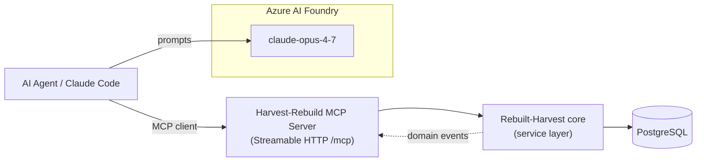

# Synthesis — Rebuilding Harvest, Agentically, with an MCP Server

Cross-cutting conclusions from the research in this folder. Read [README.md](README.md) for the map;
this file is the "so what — what do we build today" layer.

---

## 1. The two agent layers (clarifying the goal)

The hackathon goal — *"an agentic framework that lets us agentically rebuild Harvest, where the rebuild exposes an MCP server"* — actually means **two distinct uses of agents**:

| Layer | Who the agent is | What it does | Powered by |
|---|---|---|---|
| **Build-time** | Coding agents (us, today) | Generate the rebuilt-Harvest codebase from this research | Claude Opus 4.7 on Azure AI Foundry (`claude-opus-4-7`) |
| **Run-time** | Agents operating the product | Track time, query reports, manage projects *through the MCP server* | Any MCP-capable client / the same Foundry model |

The **MCP server is the contract** between the run-time agents and the rebuilt product. Designing it well (Section 4) is the highest-leverage thing we do, because it's both the demo and the integration surface.

---

## 2. What we now know about Harvest (the essentials)

- **Domain core is small.** The whole product orbits one entity — **TimeEntry** — connected to User, Project, Task, Client, via two join tables (**TaskAssignment**, **UserAssignment**). Everything else (invoices, estimates, expenses) is downstream billing. → *An MVP that nails the time-tracking core is genuinely useful on its own.*
- **Auth** (Harvest's): `Authorization: Bearer <token>` + `Harvest-Account-Id` + a required `User-Agent`. PAT and OAuth2 both supported. See [api/00-overview.md](api/00-overview.md).
- **Rate limits:** 100 req / 15 s general; 100 req / 15 min reports; `429` + `Retry-After`.
- **Two time-entry input modes**, chosen account-wide by `company.wants_timestamp_timers`: by **duration** (`hours`) or by **timestamps** (`started_time`/`ended_time`). Read `GET /v2/company` first.
- **Rates are snapshots, not relations.** Billable/cost rates are denormalized onto User / UserAssignment / TaskAssignment / Task and copied onto each TimeEntry at creation. There is no rate-history table in the API.
- **`approval_status`** (`unsubmitted` / `submitted` / `approved`) is the live concept; `is_closed` is deprecated.
- **No webhooks. At all.** Harvest v2 has no events/webhooks/notifications — integrators poll with `updated_since`. See [api/company-webhooks.md](api/company-webhooks.md).

---

## 3. The biggest opportunity: fix what Harvest can't do

Because Harvest has **no real-time event layer**, agents integrating with it can only poll. Our rebuild can be **event-native and MCP-native from day one** — that's the differentiator and it's exactly what makes it a good agent platform:

- Emit domain events (timer started/stopped, entry created, budget threshold crossed).
- Expose those to agents via MCP (resources + notifications) instead of forcing polling.
- This is the "agentic framework" payoff — agents *react* to the product, not just call it.

---

## 4. Rebuild architecture (recommended)

**Stack (hackathon-pragmatic):**
- **MCP server:** official TypeScript SDK (`@modelcontextprotocol/sdk`), **Streamable HTTP** transport (spec `2025-06-18`), single `/mcp` endpoint → supports multiple concurrent agent clients. See [mcp-server.md](mcp-server.md).
- **Data:** PostgreSQL + Prisma; schema seeded from [data-model.md](data-model.md) (MVP entity set only).
- **Model access:** Azure AI Foundry, deployment `claude-opus-4-7` (Anthropic). Keep the agent layer model-agnostic.

**MCP surface (proposed):** ~25 tools across Time Entries (8, incl. start/stop/restart timer), Projects (4), Tasks (3), Clients (3), Users (3), Timesheets (2), Reports (2); plus 9 read-only `harvest://` resources. Full spec in [mcp-server.md](mcp-server.md).

---

## 5. MVP scope for the hackathon

**Build (Must):** live timer (start/stop) · manual day + week entry · notes · billable flag · Client · Project CRUD · Task library + assignments · User assignment to projects · User CRUD (with weekly capacity) · Admin/Member roles · time report (filter by user/project/date) · hours budget per project. (From [product-scope.md](product-scope.md).)

**Defer (Won't, this hackathon):** invoicing, estimates, payments, accounting sync, expenses, client portal.

**Signature demo:** *an AI agent, via MCP, starts a timer / logs time against a project, then answers "how many hours did we burn on Project X this week vs budget?"* — proves both agent layers and the event/report loop.

---

## 6. Recommended build sequence (today)

1. **Prove the MCP transport** — scaffold Node/TS, install SDK, expose a `ping` tool on `/mcp`, verify with `npx @modelcontextprotocol/inspector`. (No domain logic yet.)
2. **Schema** — Prisma models for the 7 MVP entities; seed with one company/user/client/project/task.
3. **Service layer** — create/list/update/delete TimeEntry; start/stop timer; respecting duration-vs-timestamp mode.
4. **MCP tools** — wire the 8 time-entry tools to the service layer. Now an agent can track time. ← *minimal viable demo*
5. **Projects/tasks/clients tools + `run_report`** — enough to answer the budget question.
6. **Connect to Foundry** — point an agent at `claude-opus-4-7` + the MCP server; run the signature demo.
7. **(Stretch) Event layer** — emit domain events; expose as MCP notifications.

---

## 7. Open questions for the team (decide before/early in build)

1. **API shape:** mirror Harvest's REST contract, or design a fresh MCP-first API? *(Recommend: keep Harvest's data model as the schema baseline, but the service/MCP layer is our own — don't reimplement Harvest's REST verbatim.)*
2. **Tracking mode:** support both duration and timestamp entry, or pick one for MVP? *(Recommend: duration + live timer for MVP; it's the simpler/more common mode.)*
3. **Multi-tenancy:** Harvest is per-account. Internal tool is likely **single-tenant** — drop `company_id` plumbing to save time? *(Recommend: yes, single-tenant for hackathon.)*
4. **Agent auth to the MCP server:** static bearer token for the hackathon, or real OAuth? *(Recommend: static token today, note OAuth as the productionization path.)*
5. **Deployment:** local for the demo, or deploy the MCP server to Azure alongside Foundry? *(Recommend: local + Inspector for the demo; Azure if time permits.)*

---

## 8. Caveats on the research itself

- Harvest's **help center / marketing pages were partly 403-gated** during research; some *permission-model* detail in [product-scope.md](product-scope.md) is inferred from API fields (`access_roles`, `is_project_manager`) and flagged as such.
- A few API doc URLs had moved (rate-limiting page 404'd; roles + project-budget report live at different paths) — corrected paths are noted in the API files. Rate-limit numbers were recovered via search, not the original page.
- Everything in the API/data-model files uses **real Harvest field names**; assumed relationships are explicitly marked "(assumed)".

_Last updated: 2026-05-21_
