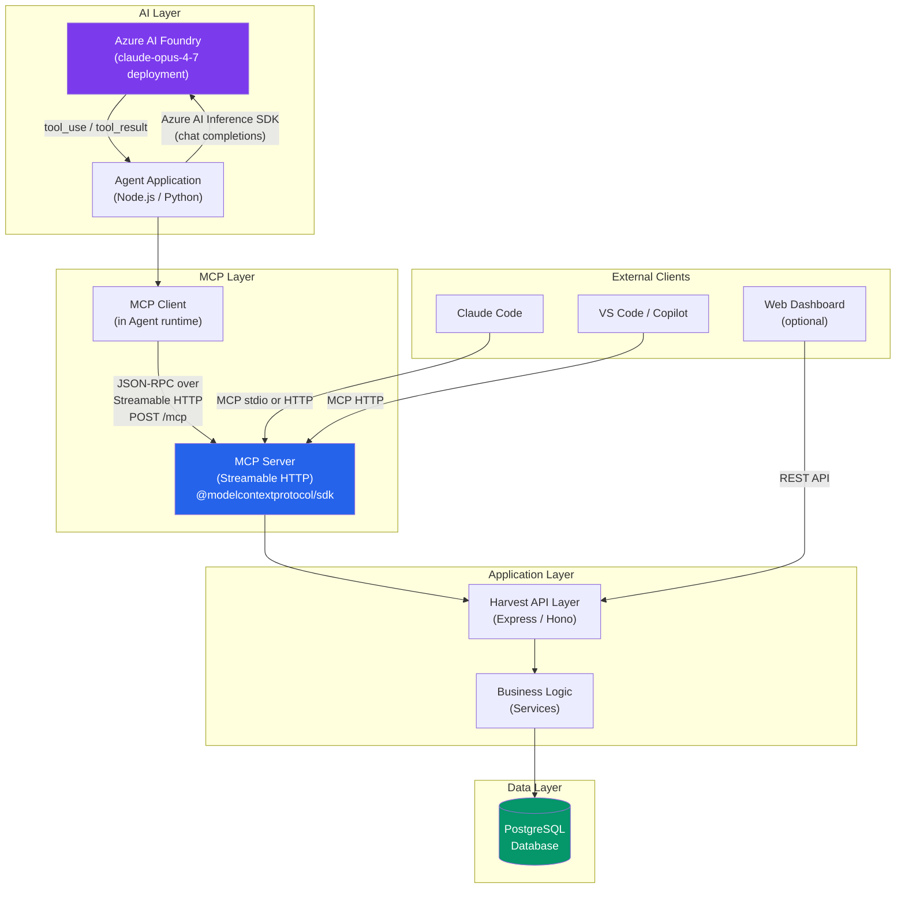

# MCP Server Design for Rebuilt Harvest

> Architecture design document for the hackathon rebuild of Harvest as an internal
> product, exposing an MCP (Model Context Protocol) server that AI agents connect into.

---

## 1. MCP Essentials

### What MCP Is

The **Model Context Protocol (MCP)** is an open-source standard for connecting AI
applications to external systems. It provides a standardized, bidirectional interface
through which AI hosts (Claude, ChatGPT, VS Code Copilot, etc.) can discover and invoke
tools, read contextual data, and use prompt templates exposed by any conforming server.
Think of it as "USB-C for AI applications" -- build once, integrate everywhere.

MCP follows a **client-server architecture** with three participant roles:

| Role | Description |
|------|-------------|
| **MCP Host** | The AI application (e.g. Claude Desktop, Claude Code, VS Code) that coordinates one or more MCP clients |
| **MCP Client** | A connector created by the host that maintains a dedicated connection to a single MCP server |
| **MCP Server** | A program that exposes context and capabilities (tools, resources, prompts) to clients |

The protocol is built on **JSON-RPC 2.0** and is stateful: connections begin with an
initialization handshake where client and server negotiate supported capabilities.

**Spec version referenced:** `2025-06-18` (latest as of this writing).

### Core Primitives

MCP defines three server-side primitives and two client-side primitives:

#### Server Primitives

| Primitive | Control Model | Purpose | Discovery | Invocation |
|-----------|--------------|---------|-----------|------------|
| **Tools** | Model-controlled | Executable functions the LLM can call (DB queries, API calls, computations) | `tools/list` | `tools/call` |
| **Resources** | Application-controlled | Read-only contextual data (files, DB schemas, config) identified by URI | `resources/list`, `resources/templates/list` | `resources/read` |
| **Prompts** | User-controlled | Reusable message templates for structured LLM interactions | `prompts/list` | `prompts/get` |

#### Client Primitives

| Primitive | Purpose |
|-----------|---------|
| **Sampling** | Allows servers to request LLM completions from the host (model-agnostic) |
| **Elicitation** | Allows servers to request additional input from the user |

### Tool Discovery and Invocation

1. Client sends `tools/list` -- server responds with an array of tool definitions, each containing `name`, `description`, `inputSchema` (JSON Schema), and optional `outputSchema`.
2. The LLM selects a tool based on the user's prompt and the tool descriptions.
3. Client sends `tools/call` with `{ name, arguments }` -- server executes and returns `{ content[], isError }`.
4. If the server's tool set changes, it emits `notifications/tools/list_changed`.

### Transports

| Transport | When to Use | How It Works |
|-----------|-------------|--------------|
| **stdio** | Local servers launched as subprocesses (e.g. Claude Desktop plugins) | Client spawns server process; messages flow over stdin/stdout, newline-delimited |
| **Streamable HTTP** (spec 2025-06-18) | Remote/networked servers; multi-client | Single HTTP endpoint; client POSTs JSON-RPC messages; server responds with `application/json` or `text/event-stream` (SSE). Supports session management via `Mcp-Session-Id` header |
| ~~HTTP+SSE~~ (spec 2024-11-05) | Legacy; superseded by Streamable HTTP | Separate SSE and POST endpoints |

**For our hackathon:** Streamable HTTP is the right choice. It allows the MCP server to
run as a standalone HTTP service that multiple agents and clients can connect to
concurrently. It also aligns with deployment on Azure.

### Authentication

MCP authentication is **optional** but when used over HTTP, it follows **OAuth 2.1**:

- The MCP server acts as an OAuth 2.1 **Resource Server**.
- The MCP client acts as an OAuth 2.1 **Client**.
- An **Authorization Server** issues access tokens.
- Discovery uses **RFC 9728** (Protected Resource Metadata) and **RFC 8414** (Authorization Server Metadata).
- Tokens are sent as `Authorization: Bearer <token>` on every HTTP request.
- **PKCE** is required; **Dynamic Client Registration** (RFC 7591) is recommended.

**For our hackathon:** We will use a simpler approach -- API key or static bearer token
passed in the `Authorization` header, validated by middleware. Full OAuth can be added
post-hackathon. For stdio-based local development, credentials come from the environment.

### Sources

- [MCP Introduction](https://modelcontextprotocol.io/introduction)
- [MCP Architecture](https://modelcontextprotocol.io/docs/learn/architecture)
- [MCP Specification 2025-06-18](https://modelcontextprotocol.io/specification/2025-06-18)
- [MCP Tools](https://modelcontextprotocol.io/docs/concepts/tools)
- [MCP Resources](https://modelcontextprotocol.io/docs/concepts/resources)
- [MCP Prompts](https://modelcontextprotocol.io/docs/concepts/prompts)
- [MCP Transports](https://modelcontextprotocol.io/docs/concepts/transports)
- [MCP Authorization](https://modelcontextprotocol.io/specification/2025-06-18/basic/authorization)
- [TypeScript SDK](https://github.com/modelcontextprotocol/typescript-sdk)
- [TypeScript SDK Server Docs](https://github.com/modelcontextprotocol/typescript-sdk/blob/main/docs/server.md)
- [Harvest API V2](https://help.getharvest.com/api-v2/)
- [Azure AI Foundry MCP Integration](https://devblogs.microsoft.com/foundry/integrating-azure-ai-agents-mcp/)

---

## 2. Recommended Stack

### SDK: `@modelcontextprotocol/sdk` (Official TypeScript SDK)

**Justification:** TypeScript is the native language of the MCP specification; the
official SDK receives same-day updates when the spec changes, has first-class Streamable
HTTP support via `@modelcontextprotocol/node`, uses Zod for schema validation (zero
boilerplate), and aligns with the team's existing Node.js/TypeScript tooling.

| Decision | Value |
|----------|-------|
| Language | TypeScript (Node.js 22+) |
| SDK | `@modelcontextprotocol/sdk` + `@modelcontextprotocol/node` |
| Transport | Streamable HTTP (single `/mcp` endpoint) |
| Schema validation | Zod (built into SDK) |
| HTTP framework | Express or Hono (SDK provides middleware helpers) |
| Database | PostgreSQL (via Prisma ORM) |
| Auth (hackathon) | Static API key in `Authorization: Bearer` header |
| Auth (production) | OAuth 2.1 per MCP spec |
| Deployment target | Azure App Service or Azure Container Apps |
| Model access | Claude Opus 4.7 on Azure AI Foundry (deployment `claude-opus-4-7`) |

> **Note on model-agnosticism:** The MCP server itself is model-agnostic -- it exposes
> tools/resources/prompts over the protocol. Any MCP-compatible client (Claude Code, VS
> Code Copilot, ChatGPT, custom agent) can connect. The team's agent code that *calls*
> the MCP server will use the Azure AI Foundry SDK to talk to `claude-opus-4-7`, but the
> MCP server has no direct dependency on any LLM.

---

## 3. Proposed MCP Tool Surface

These are the MCP tools the server will expose. Each tool maps to a Harvest domain
operation. The agent can discover them via `tools/list` and invoke them via `tools/call`.

### 3.1 Time Entry Tools

| Tool Name | Purpose | Input Parameters | Output | Harvest Operation |
|-----------|---------|-----------------|--------|-------------------|
| `list_time_entries` | List/filter time entries | `user_id?: number`, `project_id?: number`, `client_id?: number`, `task_id?: number`, `is_running?: boolean`, `from?: string (date)`, `to?: string (date)`, `page?: number`, `per_page?: number` | `{ entries: TimeEntry[], total_entries: number, total_pages: number }` | `GET /v2/time_entries` |
| `get_time_entry` | Get a single time entry by ID | `time_entry_id: number` | `{ entry: TimeEntry }` | `GET /v2/time_entries/{id}` |
| `create_time_entry` | Create a new time entry (duration-based) | `project_id: number`, `task_id: number`, `spent_date: string (date)`, `hours?: number`, `notes?: string`, `user_id?: number`, `is_billable?: boolean` | `{ entry: TimeEntry }` | `POST /v2/time_entries` |
| `update_time_entry` | Update an existing time entry | `time_entry_id: number`, `project_id?: number`, `task_id?: number`, `spent_date?: string`, `hours?: number`, `notes?: string`, `is_billable?: boolean` | `{ entry: TimeEntry }` | `PATCH /v2/time_entries/{id}` |
| `delete_time_entry` | Delete a time entry | `time_entry_id: number` | `{ success: boolean }` | `DELETE /v2/time_entries/{id}` |
| `start_timer` | Start a new running timer | `project_id: number`, `task_id: number`, `notes?: string`, `user_id?: number` | `{ entry: TimeEntry }` | `POST /v2/time_entries` (no hours = starts running) |
| `stop_timer` | Stop a running timer | `time_entry_id: number` | `{ entry: TimeEntry }` | `PATCH /v2/time_entries/{id}/stop` |
| `restart_timer` | Restart a stopped timer | `time_entry_id: number` | `{ entry: TimeEntry }` | `PATCH /v2/time_entries/{id}/restart` |

### 3.2 Project Tools

| Tool Name | Purpose | Input Parameters | Output | Harvest Operation |
|-----------|---------|-----------------|--------|-------------------|
| `list_projects` | List all projects, optionally filtered | `client_id?: number`, `is_active?: boolean`, `page?: number`, `per_page?: number` | `{ projects: Project[], total_entries: number }` | `GET /v2/projects` |
| `get_project` | Get a single project | `project_id: number` | `{ project: Project }` | `GET /v2/projects/{id}` |
| `create_project` | Create a new project | `client_id: number`, `name: string`, `is_billable?: boolean`, `bill_by?: string`, `budget_by?: string`, `budget?: number`, `notes?: string` | `{ project: Project }` | `POST /v2/projects` |
| `update_project` | Update project details | `project_id: number`, `name?: string`, `is_active?: boolean`, `is_billable?: boolean`, `budget?: number`, `notes?: string` | `{ project: Project }` | `PATCH /v2/projects/{id}` |

### 3.3 Task Tools

| Tool Name | Purpose | Input Parameters | Output | Harvest Operation |
|-----------|---------|-----------------|--------|-------------------|
| `list_tasks` | List all tasks | `is_active?: boolean`, `page?: number` | `{ tasks: Task[] }` | `GET /v2/tasks` |
| `create_task` | Create a new task | `name: string`, `billable_by_default?: boolean`, `default_hourly_rate?: number` | `{ task: Task }` | `POST /v2/tasks` |
| `list_project_task_assignments` | List tasks assigned to a project | `project_id: number`, `is_active?: boolean` | `{ task_assignments: TaskAssignment[] }` | `GET /v2/projects/{id}/task_assignments` |

### 3.4 Client Tools

| Tool Name | Purpose | Input Parameters | Output | Harvest Operation |
|-----------|---------|-----------------|--------|-------------------|
| `list_clients` | List all clients | `is_active?: boolean`, `page?: number` | `{ clients: Client[] }` | `GET /v2/clients` |
| `get_client` | Get a single client | `client_id: number` | `{ client: Client }` | `GET /v2/clients/{id}` |
| `create_client` | Create a new client | `name: string`, `currency?: string`, `is_active?: boolean` | `{ client: Client }` | `POST /v2/clients` |

### 3.5 User Tools

| Tool Name | Purpose | Input Parameters | Output | Harvest Operation |
|-----------|---------|-----------------|--------|-------------------|
| `get_current_user` | Get the authenticated user's profile | *(none)* | `{ user: User }` | `GET /v2/users/me` |
| `list_users` | List all users | `is_active?: boolean`, `page?: number` | `{ users: User[] }` | `GET /v2/users` |
| `list_user_project_assignments` | List projects assigned to a user | `user_id: number` | `{ project_assignments: ProjectAssignment[] }` | `GET /v2/users/{id}/project_assignments` |

### 3.6 Timesheet / Approval Tools

| Tool Name | Purpose | Input Parameters | Output | Harvest Operation |
|-----------|---------|-----------------|--------|-------------------|
| `get_timesheet` | Get a user's timesheet for a date range | `user_id?: number`, `from: string (date)`, `to: string (date)` | `{ entries: TimeEntry[], total_hours: number, status_summary: object }` | `GET /v2/time_entries` (filtered + aggregated) |
| `submit_timesheet` | Submit timesheet entries for approval | `user_id?: number`, `from: string (date)`, `to: string (date)` | `{ submitted_count: number, entries: TimeEntry[] }` | Custom: bulk update `approval_status` to `submitted` |

### 3.7 Report Tools

| Tool Name | Purpose | Input Parameters | Output | Harvest Operation |
|-----------|---------|-----------------|--------|-------------------|
| `run_time_report` | Generate a time report by client/project/task/user | `from: string (date)`, `to: string (date)`, `group_by?: "client" \| "project" \| "task" \| "user"`, `project_id?: number`, `client_id?: number` | `{ results: TimeReportRow[], total_hours: number, billable_hours: number }` | `GET /v2/reports/time/...` |
| `run_project_budget_report` | Show budget vs. actual for projects | `project_id?: number`, `is_active?: boolean`, `page?: number` | `{ results: BudgetReportRow[] }` | `GET /v2/reports/project_budget` |

### Tool Count Summary

| Category | Count |
|----------|-------|
| Time entries | 8 |
| Projects | 4 |
| Tasks | 3 |
| Clients | 3 |
| Users | 3 |
| Timesheets | 2 |
| Reports | 2 |
| **Total** | **25** |

---

## 4. Proposed MCP Resources

Resources are **read-only, application-driven** context that the agent (or host
application) can fetch to understand the current state. They use custom URI schemes
following RFC 3986.

| Resource URI | Name | Description | MIME Type | Template? |
|-------------|------|-------------|-----------|-----------|
| `harvest://users/me` | Current User | Authenticated user's profile, role, and permissions | `application/json` | No |
| `harvest://projects` | Active Projects | List of all active projects with client associations | `application/json` | No |
| `harvest://projects/{project_id}` | Project Detail | Full project details including budget, billing, task assignments | `application/json` | Yes |
| `harvest://clients` | Active Clients | List of all active clients | `application/json` | No |
| `harvest://tasks` | Task Catalog | List of all available tasks | `application/json` | No |
| `harvest://users` | User Directory | List of all active users | `application/json` | No |
| `harvest://timesheet/current` | Current Timesheet | Current user's time entries for the current week | `application/json` | No |
| `harvest://timesheet/{user_id}/{week_start}` | User Timesheet | A specific user's timesheet for a given week | `application/json` | Yes |
| `harvest://reports/time/{from}/{to}` | Time Report | Aggregated time report for a date range | `application/json` | Yes |

### Why Resources and Not Just Tools?

Resources are ideal for **pre-loading context** into the LLM's window before the
conversation begins. For example, when an agent is asked "submit my timesheet", the host
can automatically inject `harvest://timesheet/current` and `harvest://users/me` as
context so the LLM understands who the user is and what entries exist -- without needing a
tool call first.

Tools, by contrast, are for **actions** the LLM decides to take during reasoning.

---

## 5. Architecture Sketch



### Component Responsibilities

| Component | Responsibility |
|-----------|---------------|
| **Azure AI Foundry** | Hosts Claude Opus 4.7; provides chat completions with tool-use capability |
| **Agent Application** | Orchestration layer: sends user prompts to Claude, receives tool_use blocks, routes them to MCP client, returns results |
| **MCP Client** | SDK-provided client that connects to the MCP server, handles `tools/list`, `tools/call`, `resources/read` |
| **MCP Server** | Exposes 25 tools + 9 resources over Streamable HTTP at `/mcp`; validates inputs; delegates to business logic |
| **Harvest API Layer** | HTTP routes + service layer implementing the actual Harvest domain operations |
| **PostgreSQL** | Persistent storage for all Harvest entities (users, clients, projects, tasks, time_entries, etc.) |

### Key Design Decisions

1. **MCP server and Harvest API are co-located** in the same process for hackathon
   simplicity. The MCP server calls service functions directly rather than making HTTP
   calls to a separate API. This can be split later.
2. **The agent is a separate process** from the MCP server. It uses the Azure AI Foundry
   SDK to call Claude and the MCP client SDK to call tools. This keeps the MCP server
   model-agnostic.
3. **Multiple clients supported.** Claude Code can connect via stdio (local dev) or
   Streamable HTTP. The custom agent connects via HTTP. VS Code can connect via HTTP.

---

## 6. Hackathon Build Sequence

Ordered from "get something working" to "polish". Each step produces a demoable
increment.

### Phase 1: Skeleton (Day 1 Morning) -- "Hello MCP"

1. **Scaffold the Node.js project** with TypeScript, install `@modelcontextprotocol/sdk`
   and `@modelcontextprotocol/node`.
2. **Create a minimal MCP server** with Streamable HTTP transport on `/mcp` that exposes
   one dummy tool (`ping` -- returns "pong").
3. **Test with MCP Inspector** (`npx @modelcontextprotocol/inspector`) to verify the
   tool is discoverable and callable.

### Phase 2: Data Layer (Day 1 Afternoon) -- "Real Data"

4. **Set up PostgreSQL** (local Docker or Azure) + Prisma schema for core entities:
   `User`, `Client`, `Project`, `Task`, `TimeEntry`.
5. **Seed the database** with sample data (2 clients, 3 projects, 5 tasks, 1 user, 10
   time entries).

### Phase 3: Core Tools (Day 1 Evening) -- "An Agent Tracks Time"

6. **Implement the 8 time entry tools** (`list_time_entries`, `get_time_entry`,
   `create_time_entry`, `update_time_entry`, `delete_time_entry`, `start_timer`,
   `stop_timer`, `restart_timer`).
7. **Implement lookup tools**: `list_projects`, `list_tasks`, `list_clients`,
   `get_current_user`.
8. **Demo**: Connect Claude Code (or MCP Inspector) to the server and have the agent
   create a time entry, start/stop a timer, and list entries.

### Phase 4: Agent Integration (Day 2 Morning) -- "Claude Drives It"

9. **Build the agent application** using Azure AI Foundry SDK pointing to
   `claude-opus-4-7`. Wire up MCP client to discover and route tool calls.
10. **End-to-end demo**: User says "Log 2 hours on Project Alpha for the Design task
    today" and the agent creates the entry via MCP.

### Phase 5: Resources + Reports (Day 2 Afternoon) -- "Context-Aware Agent"

11. **Implement MCP resources**: `harvest://users/me`, `harvest://projects`,
    `harvest://timesheet/current`.
12. **Implement report tools**: `run_time_report`, `run_project_budget_report`.
13. **Implement timesheet tools**: `get_timesheet`, `submit_timesheet`.

### Phase 6: Polish (Day 2 Evening) -- "Demo-Ready"

14. **Add remaining CRUD tools** (create_project, create_client, create_task, etc.).
15. **Add API key auth middleware** on the MCP endpoint.
16. **Deploy** to Azure App Service or Container Apps.
17. **Prepare demo script**: agent tracks a full day of work, generates an end-of-week
    report, submits the timesheet.

### Minimal Viable Demo (end of Phase 3)

The single most important demo is: **"An AI agent creates a time entry via MCP."** This
proves the end-to-end chain: Agent --> MCP Client --> MCP Server --> Database. Everything
else is incremental value on top.

---

## Appendix A: TypeScript SDK Quick-Start Reference

```typescript
import { McpServer } from "@modelcontextprotocol/sdk/server/mcp.js";
import { NodeStreamableHTTPServerTransport }
  from "@modelcontextprotocol/node/server/streamableHttp.js";
import { z } from "zod";
import { randomUUID } from "node:crypto";
import express from "express";

// 1. Create server
const server = new McpServer({
  name: "harvest-mcp",
  version: "0.1.0",
});

// 2. Register a tool
server.registerTool("create_time_entry", {
  title: "Create Time Entry",
  description: "Create a new time entry for a project and task",
  inputSchema: z.object({
    project_id: z.number().describe("The project ID"),
    task_id: z.number().describe("The task ID"),
    spent_date: z.string().describe("Date in YYYY-MM-DD format"),
    hours: z.number().optional().describe("Hours worked"),
    notes: z.string().optional().describe("Notes about the work"),
  }),
}, async ({ project_id, task_id, spent_date, hours, notes }) => {
  // ... call service layer to create entry in DB ...
  const entry = await timeEntryService.create({
    project_id, task_id, spent_date, hours, notes
  });
  return {
    content: [{ type: "text", text: JSON.stringify(entry) }],
  };
});

// 3. Register a resource
server.registerResource("current-user", "harvest://users/me", {
  title: "Current User",
  description: "The authenticated user's profile",
  mimeType: "application/json",
}, async (uri) => ({
  contents: [{
    uri: uri.href,
    mimeType: "application/json",
    text: JSON.stringify(await userService.getCurrentUser()),
  }],
}));

// 4. Set up Streamable HTTP transport
const app = express();
app.use(express.json());

app.all("/mcp", async (req, res) => {
  const transport = new NodeStreamableHTTPServerTransport({
    sessionIdGenerator: () => randomUUID(),
  });
  await server.connect(transport);
  await transport.handleRequest(req, res);
});

app.listen(3000, () => console.log("Harvest MCP server on :3000/mcp"));
```

## Appendix B: Entity Reference (TypeEntry)

Key fields the agent will see in tool responses:

```typescript
interface TimeEntry {
  id: number;
  spent_date: string;        // "2026-05-21"
  hours: number;             // 2.5
  rounded_hours: number;     // 2.5
  notes: string | null;
  is_running: boolean;
  is_locked: boolean;
  is_billed: boolean;
  billable: boolean;
  approval_status: "unsubmitted" | "submitted" | "approved";
  started_time: string | null;  // "08:00"
  ended_time: string | null;    // "10:30"
  timer_started_at: string | null;
  user: { id: number; name: string };
  client: { id: number; name: string };
  project: { id: number; name: string };
  task: { id: number; name: string };
  created_at: string;
  updated_at: string;
}
```
